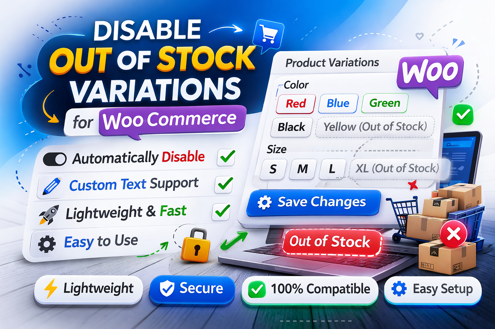

# Disable Out of Stock Variations for WooCommerce

Automatically disables out-of-stock variations in WooCommerce dropdowns and allows custom "Out of Stock" text.

## Features

- Disable selection of out-of-stock product variations
- Display custom "Out of Stock" text or use the default text
- Works for all variable WooCommerce products
- WordPress.org safe, sanitized, and ready for use
- PHP >= 7.4 and WordPress >= 5.9 compatible

---

## Installation

1. Download the plugin ZIP file
2. Upload the plugin to your WordPress site: `Plugins > Add New > Upload Plugin`
3. Activate the plugin
4. Go to `WooCommerce > Variation Stock` in the admin menu to set your custom "Out of Stock" text

---

## Usage

Once activated:

- Any out-of-stock variation in variable products will be **disabled in the dropdown**.
- The dropdown will display your custom "Out of Stock" text, or "Out of stock" if left empty.
- Users cannot select out-of-stock variations.

---

## Frequently Asked Questions (FAQ)

**Q: Can I leave the Out of Stock text empty?**  
A: Yes, it will default to "Out of stock".

**Q: Does this work with all themes?**  
A: It works with all themes that follow standard WooCommerce variable product dropdowns.

**Q: What if WooCommerce is not installed?**  
A: The plugin will automatically deactivate and show an admin notice.

---

## Changelog

###  1.0.2 =
- Refactored internationalization (i18n) system.
- Added full multi-language support (8 languages).
- Added translation files (PO) for:
  - English (en_US)
  - Persian (fa_IR)
  - German (de_DE)
  - French (fr_FR)
  - Spanish (es_ES)
  - Italian (it_IT)
  - Chinese Simplified (zh_CN)
  - Japanese (ja)
- Improved gettext implementation for better localization.
- Minor code improvements and cleanup.

### 1.0.1
- Fixed display of custom "Out of Stock" text in variation dropdowns
- Code cleanup and WordPress.org safe adjustments

### 1.0.0
- Initial release

---

## Screenshots

---

## License

GPLv2 or later. See [LICENSE](LICENSE) file for details.

---

## Author

Amirreza Saeedabadi
